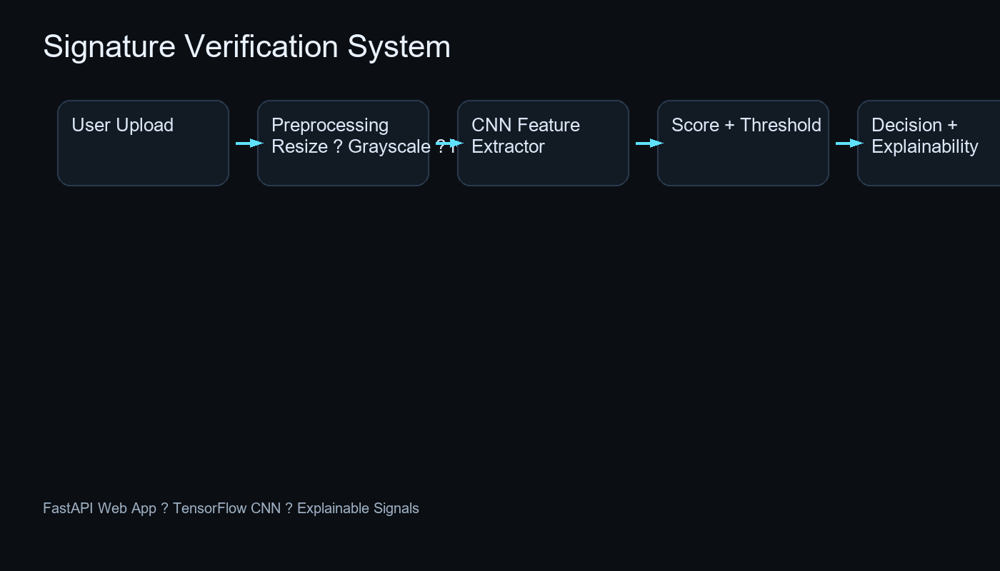
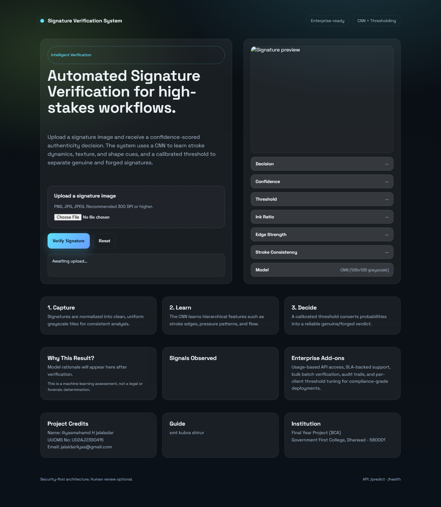
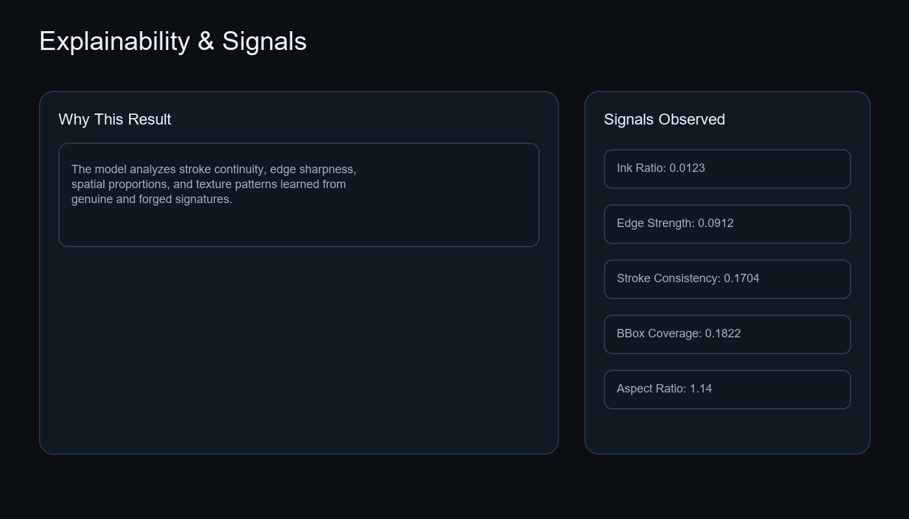
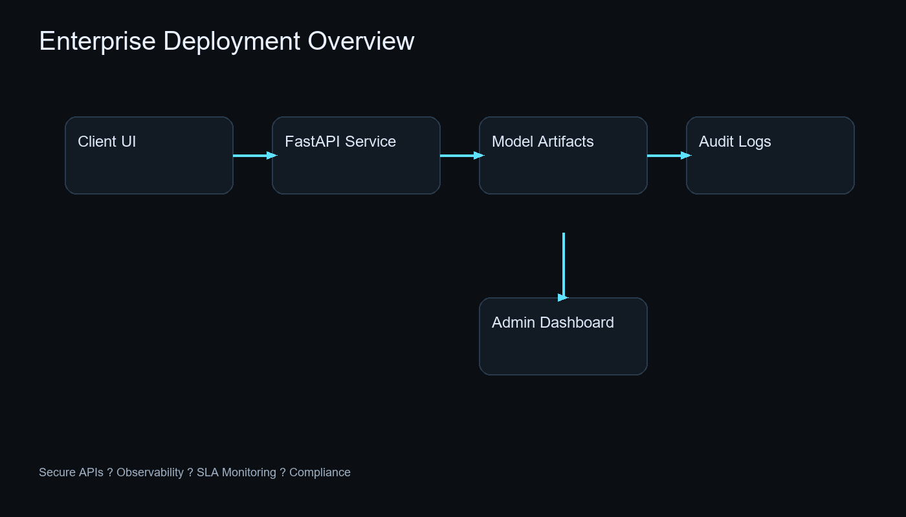

# Signature Verification System (CNN)

Enterprise-ready **Signature Verification System** using a CNN and FastAPI. It delivers automated verification, explainable signals, and a production-style UI.









## Training Recording

Watch the screen recording of the model training and setup process:

[Training Session Video](Recording 2026-03-11 213729.mp4)

## Features
- CNN-based verification with calibrated thresholding
- Explainable signal diagnostics (ink ratio, edge strength, stroke consistency)
- FastAPI web app with a premium UI
- One-click `start.bat` for setup and launch
- Docker support

## Quick Start (Windows)

1. Run the launcher:

```powershell
start.bat
```

This will:
- Create a virtual environment if missing
- Install dependencies
- Start the server at `http://127.0.0.1:8000`
- Open the browser automatically

**Note:** If trained model artifacts exist in `artifacts/`, it will **skip download and training**.

## Manual Setup

```powershell
C:\Users\Lenovo\AppData\Local\Programs\Python\Python312\python.exe -m venv .venv
.\.venv\Scripts\python.exe -m pip install -r requirements.txt
.\.venv\Scripts\python.exe -m uvicorn app.main:app --host 127.0.0.1 --port 8000 --reload
```

Open `http://127.0.0.1:8000`.

## Dataset (Optional for Retraining)

The project supports Kaggle datasets for retraining. Default dataset used:
- `robinreni/signature-verification-dataset`

To retrain:

```powershell
.\.venv\Scripts\python.exe scripts\fetch_data.py --source kaggle --dataset robinreni/signature-verification-dataset
.\.venv\Scripts\python.exe scripts\prepare_data.py
.\.venv\Scripts\python.exe scripts\train.py
```

You must have Kaggle credentials at `C:\Users\<you>\.kaggle\kaggle.json`.

## API

- `GET /health` ? health check
- `POST /predict` ? upload an image file (`file` form field)

Example response:

```json
{
  "label": "genuine",
  "score": 0.84,
  "threshold": 0.26,
  "signals": {
    "ink_ratio": 0.0123,
    "bbox_coverage": 0.1822,
    "aspect_ratio": 1.14,
    "edge_strength": 0.0912,
    "edge_density": 0.0722,
    "stroke_consistency": 0.1704
  },
  "detail": "The model analyzes stroke continuity, edge sharpness, spatial proportions, and texture patterns learned from genuine and forged samples.",
  "rationale": [
    "Signature exhibits typical stroke density, edge definition, and spatial coverage."
  ]
}
```

## Architecture

- **Preprocessing:** resize, grayscale, normalize
- **CNN Feature Extractor:** learns stroke texture + shape cues
- **Scoring:** probabilistic output calibrated via threshold
- **Explainability:** signals derived from ink density and edge statistics

## Deployment

### Docker

```powershell
docker build -t signature-verifier .
docker run -p 8000:8000 -v ${PWD}\artifacts:/app/artifacts signature-verifier
```

### Production Guidance
- Use a reverse proxy (Nginx/Traefik)
- Enable HTTPS and request size limits
- Monitor latency and error rates
- Log verification outcomes for audit trails

## Project Credits

- **Name:** iliyasmahamd H jalaladar
- **UUCMS No:** U02AJ23S0415
- **Email:** jalaldarilyas@gmail.com
- **Guide:** smt kubra shirur
- **Program:** Final Year Project (BCA)
- **Institution:** Government First College, Dharwad - 580001

## License

Educational use. For commercial deployment, add an explicit license file.
